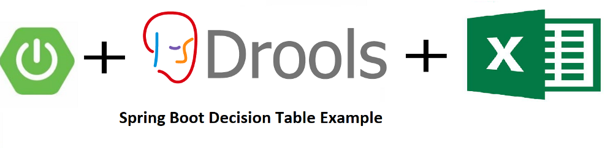

# spring-boot-drools-demo
Spring boot drools decision table example.

## Rest Controller
The class `OrderDiscountController.java` contains the endpoint which executes the business logic and returns response.

## Libraries used
- Spring Boot
- Spring Configuration
- Spring REST Controller
- Drools
- Development Tools

	
## Compilation Command
- `mvn clean install` - Plain maven clean and install

## Reference
Please follow on my medium for detailed explainations

https://medium.com/@reachansari/spring-boot-drools-decision-table-example-fd569eec56e0